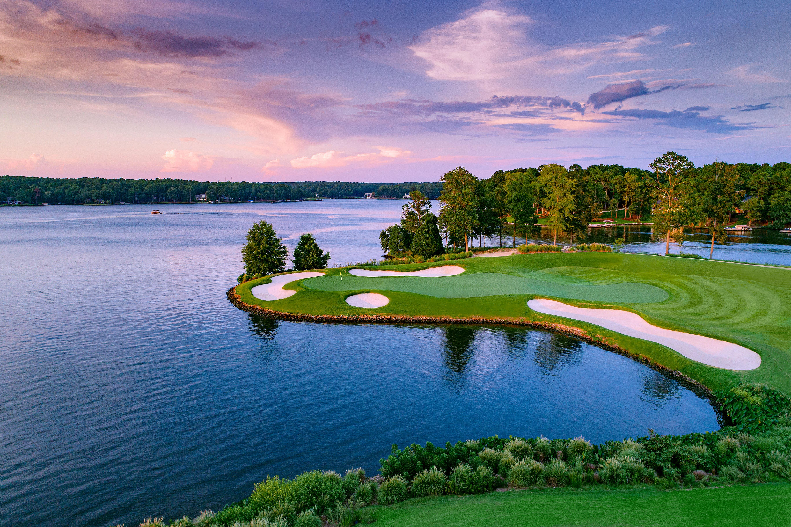

# Green Golf Carbon

Transforming golf courses and managed turf into **carbon sinks** using innovative **basalt-enhanced sand** technology.



---

## Table of Contents
- [Overview](#overview)
- [Features](#features)
- [Tech Stack](#tech-stack)
- [Getting Started](#getting-started)
- [Project Structure](#project-structure)
- [Editing Site Content](#editing-site-content)
- [Anchors & Smooth Scrolling](#anchors--smooth-scrolling)
- [Logos & Images](#logos--images)
- [Styling & UI](#styling--ui)
- [Quality Checks](#quality-checks)
- [Deployment](#deployment)
- [Contributing](#contributing)
- [License](#license)
- [Contact](#contact)

---

## Overview

**Green Golf Carbon** showcases how basalt-enhanced sand improves soil quality and captures atmospheric CO₂ across golf courses and managed turf. This site is a marketing/landing page built with **Next.js** and styled with **Tailwind CSS**, featuring smooth in-page navigation and responsive layout.

---

## Features

- ✨ **Hero section** with headline & responsive image
- 🧭 **Sticky navbar** with smooth scrolling to sections
- 🔗 **Footer quick links** (Technology, Benefits, Team)
- 📱 Fully **responsive** layout
- ♿ Accessible defaults (semantic HTML, keyboard-friendly nav)
- ⚡ Built on **Next.js** Image optimization

---

## Tech Stack

- **Framework:** Next.js (React, TypeScript ready)
- **Styling:** Tailwind CSS
- **UI:** shadcn/ui components, lucide-react icons
- **Images:** `next/image` from `/public`

---

## Getting Started

> Prereqs: Node.js LTS (18+ recommended) and npm or yarn.

```bash
# 1) Install dependencies
npm install

# 2) Start the dev server
npm run dev
# Open http://localhost:3000

# 3) Build for production
npm run build

# 4) Start production server
npm start
